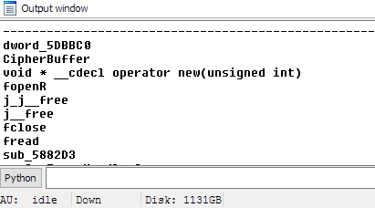
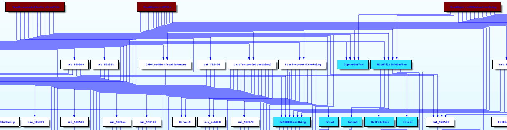

==================
Xref Intersections
==================

Info
----

This plugin generates a list of intersecting references between multiple reference trees. It can display the results as either a graph or console output

Dependencies
------------

1. [Sark](https://github.com/tmr232/Sark/)
